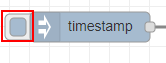

# Lab 1: Your First Flow
1.	Start Node-RED. Instructions are available in the official Node-RED documentation for [running locally](https://nodered.org/docs/getting-started/running) or [running on a Raspbery Pi](https://nodered.org/docs/hardware/raspberrypi)
2.	Using a web browser, access the Node-RED editor at {IP_ADDRESS}:1880 where {IP_ADDRESS} points to the device running Node-RED.
3.	Insert an inject node. The inject node is under the input category.  

4.	Insert a debug node. The debug node is under the output category.  

5.	Wire the output port of the inject node to the input node of the debug node. You can wire nodes by left clicking on an output port and dragging to an output port. When you release the mouse, the nodes will be wired. Note that for the wiring to take effect you have to deploy the flow.  

6.	Deploy your new flow by clicking on the red Deploy button in the Header.  

7.	Click on the box on the left side of the deployed inject node to trigger a data injection and send data to the debug node.  

8.	Click on the debug tab in the information pane to see what was received by the debug node.  


9.	Configure the debug node to show the entire message. To open a node's configuration, double click on the node. Set the debug node's output property to "complete message object" then click the red Done button.  

10.	Deploy the updated flow by clicking on the red Deploy button.  

11.	Click on the inject node to send data.  

12.	Look at the whole message object now displayed in the debug pane.   

13.	Add a function node to your flow. The function node is under the function category.  

14. Delete the existing wire between the input node and the debug node. You can delete a wire by left clicking on it then pressing the delete key. The wire will turn orange when it is selected.  

15. Wire the output port of the inject node to the input port of the function node.

16. Wire the output port of the function node to the input port of the debug node.

17.	Double click on the function node to open it's configuration.
18.	Under the function field, write the following code which will format the injected timestamp into a human readable date. This code should be put into line 1 of the function node. Click done when done.   
```msg.payload = new Date(msg.payload).toString();```

19.	Deploy your new flow.  

20.	Click on the inject node to send data.   

21.	Look at the message object with a human readable date now displayed in the debug pane.   


If you want to see the completed lab, import the following code   
```[{"id":"a453d6e5.4c4348","type":"tab","label":"Flow 1"},{"id":"93e98162.73706","type":"inject","z":"a453d6e5.4c4348","name":"","topic":"","payload":"","payloadType":"date","repeat":"","crontab":"","once":false,"onceDelay":0.1,"x":120,"y":1240,"wires":[["a3f18127.ed01a"]]},{"id":"a3f18127.ed01a","type":"debug","z":"a453d6e5.4c4348","name":"","active":true,"tosidebar":true,"console":false,"tostatus":false,"complete":"false","x":370,"y":1240,"wires":[]},{"id":"59a3396a.bae478","type":"inject","z":"a453d6e5.4c4348","name":"","topic":"","payload":"","payloadType":"date","repeat":"","crontab":"","once":false,"onceDelay":0.1,"x":120,"y":1320,"wires":[["960b41c1.84363"]]},{"id":"960b41c1.84363","type":"debug","z":"a453d6e5.4c4348","name":"","active":true,"tosidebar":true,"console":false,"tostatus":false,"complete":"true","x":350,"y":1320,"wires":[]},{"id":"555ec3e2.6c7dac","type":"debug","z":"a453d6e5.4c4348","name":"","active":true,"tosidebar":true,"console":false,"tostatus":false,"complete":"false","x":450,"y":1400,"wires":[]},{"id":"d185824d.701b5","type":"inject","z":"a453d6e5.4c4348","name":"","topic":"","payload":"","payloadType":"date","repeat":"","crontab":"","once":false,"onceDelay":0.1,"x":120,"y":1400,"wires":[["fd9b34fc.3e6b48"]]},{"id":"fd9b34fc.3e6b48","type":"function","z":"a453d6e5.4c4348","name":"","func":"msg.payload = new Date(msg.payload).toString()\nreturn msg;","outputs":1,"noerr":0,"x":270,"y":1400,"wires":[["555ec3e2.6c7dac"]]}]```