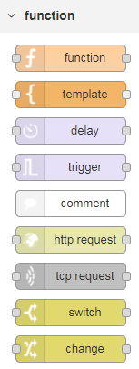
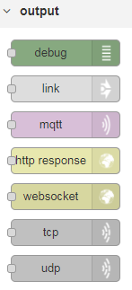
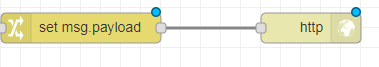

# Lab 2: Going Online with HTTP
1.	Insert a http input node.   

2.	Double click on the http input node and set the URL property to "/welcome".   

3.	Insert a change node. Change nodes can be found under the function category of the palette.   

4.	Wire the http node output port to the change node input port.   

5.	Double click on the change node and set the payload to a custom message of your choice then click the red Done button.   

6.	Insert an http response node. Http response nodes can be found under the output category of the palette.   

7.	Wire the change node output port to the http response node input port.   

8.	Deploy your updated flow.   

9.	Using a web browser, access {YOUR_NODE_IP}:1800/welcome to trigger your flow.   

10.	You should see your custom message displayed in the browser window.   


If you want to see the completed lab, import the following code   
```[{"id":"a453d6e5.4c4348","type":"tab","label":"Flow 1"},{"id":"701048c3.b8d2e8","type":"http in","z":"a453d6e5.4c4348","name":"","url":"welcome","method":"get","upload":false,"swaggerDoc":"","x":200,"y":1200,"wires":[["3218623d.88e11e"]]},{"id":"c3bff1fe.35b28","type":"http response","z":"a453d6e5.4c4348","name":"","statusCode":"","headers":{},"x":590,"y":1200,"wires":[]},{"id":"3218623d.88e11e","type":"change","z":"a453d6e5.4c4348","name":"","rules":[{"t":"set","p":"payload","pt":"msg","to":"Welcome to my site!","tot":"str"}],"action":"","property":"","from":"","to":"","reg":false,"x":400,"y":1200,"wires":[["c3bff1fe.35b28"]]}]```