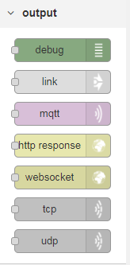
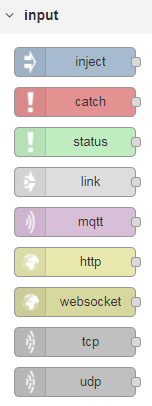

# Lab 3: Get to know your Pi
1.	Insert a Sense HAT input node. The Sense HAT node is under the Raspberry Pi category and has 1 output port (right side) and no input ports (left side).   

2.	Insert a debug node.   

3.	Wire the output port of the Sense HAT node to the input port of the debug node.   

4.	Deploy your flow.   

5.	Using the debug pane, look at the events that come from the Sense HAT. Disable the debug node by clicking on it to stop the flow of data. Expand a debug message to see the contents.   

6.	Insert a Sense HAT output node. The Sense HAT output node can be found under the Raspberry Pi category and has 1 input port (left side) and no output ports (right side).   

7.	Insert an inject node.   

8.	Double click on the inject node and set the inject node’s payload to the string “*,*,red” then click the Done button.   

9.	Wire the inject node’s output port to the Sense HAT output nodes input port.   

10.	Deploy your flow.   

11.	Trigger the inject node by clicking on it.   

12. Note how your Pi's SenseHAT changes to red!   

13. Insert 4 additional inject nodes.   

14. Double click one inject node and set it's payload to the string   
 ```*,0,red,*,2,red,*,4,red,*,6,red```   
Name the node "Red" then click the Done button.   
15. Double click a non named inject node and set it's payload to the string   
 ```*,1,white,*,3,white,*,5,white,*,7,white```   
Name the node "White" then click the Done button.   
16. Double click a non named inject node and set it's payload to the string   
 ```0-3,0-2,blue```   
Name the node "Blue" then click the Done button.   
17. Double click a non named inject node and set it's payload to a string of your choice   
```Know the earth, show the way, understand the world```   
Name the node "Message" then click the Done button.
18. Wire the output ports of the "Red", "White", "Blue", and "Message" inject nodes to the input port of the Sense HAT output node.
19. Click on the inject nodes in this order: 
  1. Red
  2. White
  3. Blue
19. Now click on the Message inject node.   
If you want to see the completed lab, import the following code   
```[{"id":"a453d6e5.4c4348","type":"tab","label":"Flow 1"},{"id":"713d71d1.86b42","type":"rpi-sensehat in","z":"a453d6e5.4c4348","name":"","motion":true,"env":true,"stick":true,"x":100,"y":60,"wires":[["65c7fd83.d362a4"]]},{"id":"cd3b3d0e.0c1f1","type":"rpi-sensehat out","z":"a453d6e5.4c4348","name":"","x":400,"y":140,"wires":[]},{"id":"b72b82cb.743b5","type":"inject","z":"a453d6e5.4c4348","name":"","topic":"","payload":"*,*,red","payloadType":"str","repeat":"","crontab":"","once":false,"onceDelay":0.1,"x":90,"y":140,"wires":[["cd3b3d0e.0c1f1"]]},{"id":"65c7fd83.d362a4","type":"debug","z":"a453d6e5.4c4348","name":"","active":false,"tosidebar":true,"console":false,"tostatus":false,"complete":"false","x":340,"y":60,"wires":[]},{"id":"965a8906.f55708","type":"inject","z":"a453d6e5.4c4348","name":"Red","topic":"","payload":"*,0,red,*,2,red,*,4,red,*,6,red","payloadType":"str","repeat":"","crontab":"","once":false,"onceDelay":0.1,"x":90,"y":180,"wires":[["cd3b3d0e.0c1f1"]]},{"id":"c23631a9.5f00c","type":"inject","z":"a453d6e5.4c4348","name":"White","topic":"","payload":"*,1,white,*,3,white,*,5,white,*,7,white","payloadType":"str","repeat":"","crontab":"","once":false,"onceDelay":0.1,"x":90,"y":220,"wires":[["cd3b3d0e.0c1f1"]]},{"id":"9796d63e.f358d8","type":"inject","z":"a453d6e5.4c4348","name":"Blue","topic":"","payload":"0-3,0-2,blue","payloadType":"str","repeat":"","crontab":"","once":false,"onceDelay":0.1,"x":90,"y":260,"wires":[["cd3b3d0e.0c1f1"]]},{"id":"16f9918e.c6756e","type":"inject","z":"a453d6e5.4c4348","name":"Message","topic":"","payload":"Know the earth, show the way, understand the world","payloadType":"str","repeat":"","crontab":"","once":false,"onceDelay":0.1,"x":100,"y":300,"wires":[["cd3b3d0e.0c1f1"]]}]```